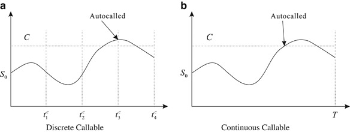
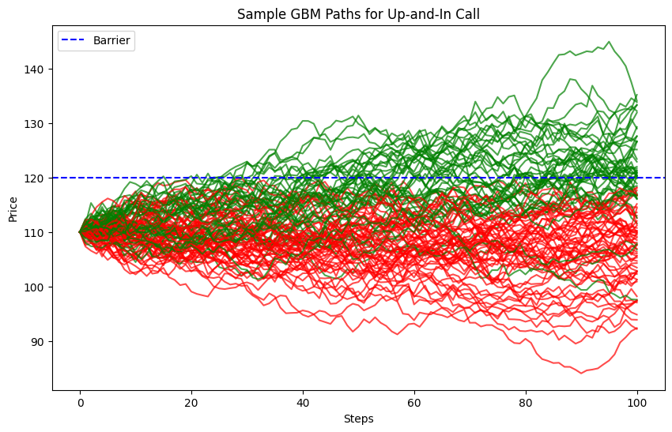
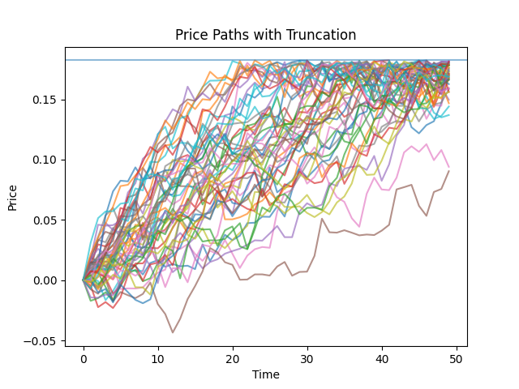
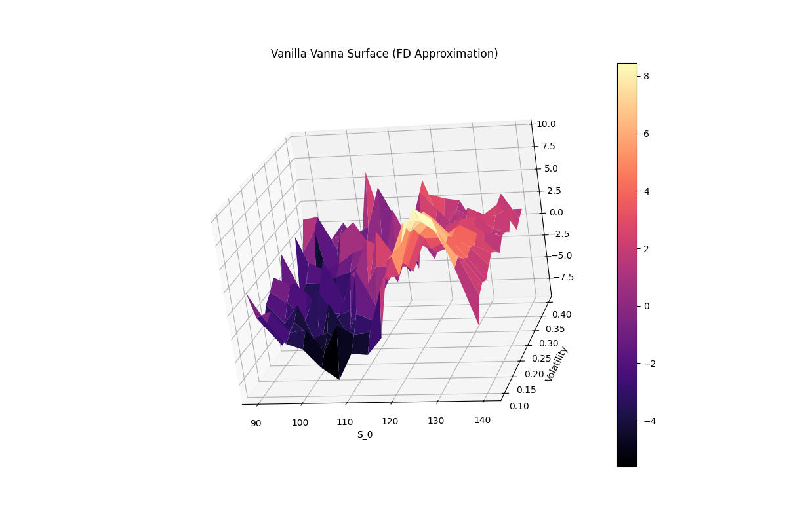
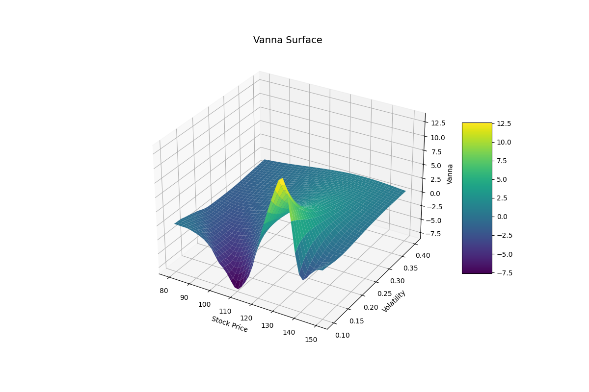

# XLA/AAD/OSS Based Pricing and Sensitivities Engine for Single-underlier Autocallable Notes

An implementation and comparative study in the varience reduction for the calculation of Greeks using One-Step-Survival, Adjoint differentiation and Vectorized linear algebra. 

---

## Project Overview
This project explores the intersection of **Pure Mathematics** and **Pricing in Finance**. Pricing and studying the sensitivities of barrier options has been a long-standing problem in the field of quantitative finance. In this Repo I will be using OSS to stabilize the monte-carlo simulation of an auto-callable and then using AAD and vectorization to stabilize the calculation of its sensitivities. A short demo is also included in this repo where you can visualize the changes in distribution for both value and Delta on a given test contract.

### 1. What are Autocallable notes?

An auto-callable not is a type of structured product that tracks another asset, usually a stock, and imposes a payment structure on top of that underliers performance. Autocallable notes can track multiple different assets at once, through a best of/worst of structure, but we will focus on single-underlier autocallables in this work. 

The Auto-Callable note is defined by its main feature, the ability for it to terminate before reaching maturity upon reaching some barrier condition on any one of a given set of pre-determined observation dates. That is, a set of dates are agreed upon beforehand, and a barrier level, if the underlier exceeds that barrier on any of those observation dates it is terminated and the buyer is paid out via coupon. If it does not cross this barrier on any of the given dates and reaches maturity, then it is paid out according to a payoff function. 

The anatomy of an Auto-Callable note generally consists of a fixed-income bond and a menagerie of embedded derivatives.

<p align="center">
  
</p>

### 2. Mathematical modelling and Barrier Options
The Application of Monte-Carlo based approaches to options pricing goes back to 1977 with the paper by Boyle, which came only four years after the seminal work by Black-Scholes. Even in this first attempt, Boyle clearly recognized and expressed the insufficiency of the traditional Monte Carlo approach in regard to options pricing. This is doubly true for barrier options, like auto-callable notes, because the "auto-call" features introduces massive discontinuities in the Monte-Carlo simulations generally used for pricing. 

<p align="center">
  
</p>

The primary issue here is that different paths "behave" differently based on whether they cross the barrier. A surviving path pays out on maturity according to a predefined payout function but an "auto-called" path terminates early and its value suddenly collapses to the coupon value given on its call. 

### Varience Reduction and One-Step-Survival
In order to fix this issue of "different behaviors", we can essentially force each path to survive untill maturity, while simultaneously tracking the survival probability of the instrument(the specifics of this method can be found in the technical document under docs/). Using this pair of values we can create a continuous estimation function of the instruments value. 

<p align="center">
  
</p>

### Sensitivities 
While this is an improvement, there is still more to optimize. Another source of varience and instability in price modelling is the usage of finite-difference methods to estimate Greeks/sensitivities of a product. The finite difference is not only imprecise, it is expensive. To calculate a first order sensitivity, one must run through an entire forward pass twice and this only becomes worse as you attempt to estimate higher order sensitivites like Gamma or Vanna. Below is an example of a Vanna plot generated with traditional, procedural Monte Carlo simulation(without One-Step-Survival).

<p align="center">
  
</p>


In order to fix this, and bring about an increase in performance as a whole, we embed these techniques within the modern XLA paradigm. That is to say, we vectorize the Monte-Carlo using JAX, then let JAX calculate the exact gradient for us with a backward pass-a process known as Automatic Adjoint Differentiation. To keep thing short, one can imagine AAD as a generalization of the "Backpropagation" algorithm from Machine learning where peturbations in an objective function are propagated backwards through what essentially boils down to the "chain-rule" from calculus. 

Using this technique, we see an increase in sensitivity estimation stability by several order of magnitude. Below is an example of a Vanna plot generated with a vectorized, One step survival based, Monte Carlo approach with AAD.

<p align="center">
  
</p>

## Key Features

*   **Vectorized Monte Carlo Engine:** High-performance derivative pricing implemented in **JAX**, utilizing XLA compilation for near-instant execution of complex path-dependent valuations.
*   **Automatic Adjoint Differentiation (AAD):** Implementation of machine-precision sensitivities via `jax.grad`, achieving a reduction by multiple order of magnitude for the varience in Delta estimation compared to traditional finite difference methods.
*   **One-Step-Survival (OSS) Integration:** Advanced importance sampling logic to "smooth" path-dependent discontinuities, ensuring numerical stability for barrier-sensitive products.

## Getting Started

1. Ensure you have python 3.8+ on your machine 
2. clone this repo 
```
git clone https://github.com/Akshatkkumar/Vectorized_Sensitivities_Engine.git
cd Vectorized_Sensitivities_Engine
```
3. Create a virtual environment(Depends on your OS). 

On Windows
```
python -m venv venv
.\venv\Scripts\activate
```
On MacOS/Linux
```
python3 -m venv venv
source venv/bin/activate
```

4. install the necessary requirements 
```
pip install -r requirements.txt
```
5. Run the test code
```
python -m scripts.main
```


## Technical Stack

| Category | Tools |
| :--- | :--- |
| **Languages** | Python (JAX, NumPy, SciPy) |
| **Quantitative Finance** | Automatic Adjoint Differentiation (AAD), Monte Carlo Simulation, One Step Survival |
| **Scientific Computing** | XLA Compilation, Vectorized SDE Simulations, Non-Parametric Density Estimation |

## Repository Structure
* `core/benchmark_procedural_noOSS.py`: A benchmark monte-carlo model with no one-step-survival implementation or XLA. Value and sensitivities estimated procedurally. Plots a distribution for both value and Delta
* `core/OSS_solver.py`: Procedural implementation of One-Step-survival to display the stabilizing effect of OSS on price-estimation. 
* `core/Vectorized_OSS_solver.py`: Vectorized implementation of One-Step-survival to display the stabilizing effect of OSS on price-estimation and of AAD on sensitivity estimation. 
* `docs/Accelerated_Stable_Differentiation__A_Vectorized_Approach_to_Pricing_Auto_Callables_in_the_Log_Space_with_Automatic_Adjoint_Differentiation.pdf`: Formal mathematical document discussing the methods used here in detail. 

## Performance Benchmarking

| Methodology | Value (Mean) | Value (Std) | Delta (Mean) | Delta (Std) |
| :--- | :--- | :--- | :--- | :--- |
| **Procedural Monte Carlo** | 87.1931 | 20.6385 (Std) | 0.0236 | 1.4347 (Std) |
| **MC + OSS** | 87.1275 | 9.9426 (Std) | 0.0192 | 0.6999 (Std) |
| **MC + OSS + JAX/AAD** | 87.1732 | 9.9613 (Std) | 0.0203 | 0.0097 (Std) |

> **Note:** The AAD implementation decreases the Std for Delta by 72x compared to the MC+OSS implementation and by 147x compared to the vanilla procedural MC. 
---
*Developed as part of an exploration into stable pricing models for barrier options*
